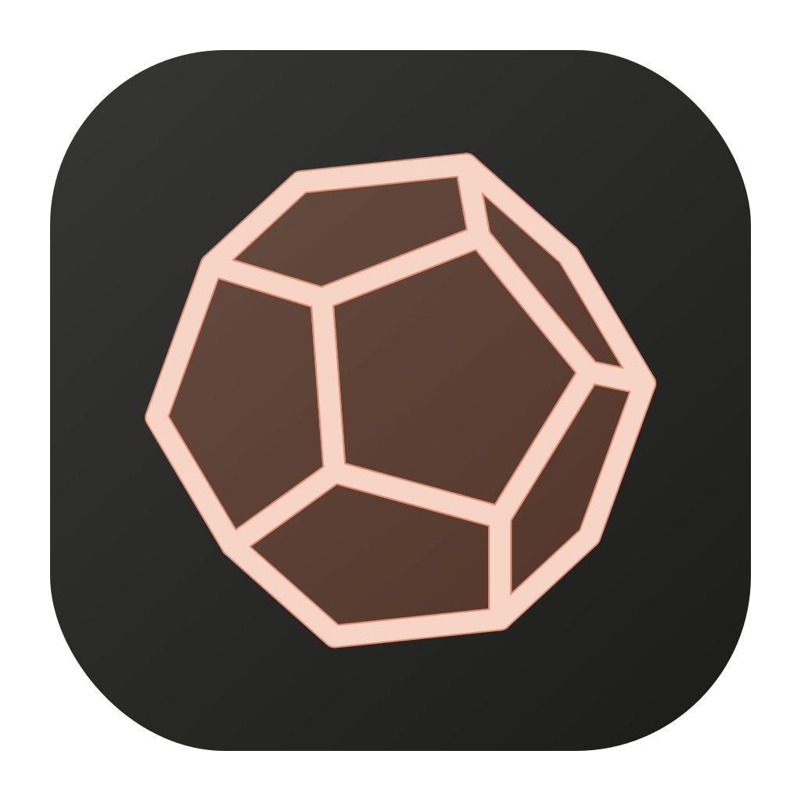

<div align="center">



# ccllrun

**Claude Code su modelli locali. Senza cloud.**

[](LICENSE)
[](#requisiti)
[](#)
[](https://github.com/ggml-org/llama.cpp)
[](https://docs.anthropic.com/claude-code)
[](#modelli)

🇬🇧 [Read it in English](README.md)

</div>

`ccllrun` esegue [Claude Code](https://docs.anthropic.com/claude-code) su modelli open serviti in locale da **llama.cpp** (`llama-server`), tramite un proxy che traduce l'API Anthropic in API OpenAI-compatibile. Include **ccllrun Studio**, un'app macOS nativa con chat, gestione dello stack, approvazione interattiva dei permessi e configurazione grafica.

```
Claude Code ──ANTHROPIC_BASE_URL──▶ proxy.py (:8765) ──┬──▶ llama-server BIG   (:8001, es. Qwen3.6-35B-A3B)
                                                       └──▶ llama-server SMALL (:8002, modello piccolo/veloce)
ccllrun Studio (:8770) ─── dashboard nativa: chat headless, stato, config, log
```

Tutto resta sulla tua macchina: l'engine ascolta solo su `127.0.0.1`, nessun dato esce.

## Partenza in 30 secondi

```bash
git clone https://github.com/robertobissanti/ccllrun.git
cd ccllrun && chmod +x ccllrun
sudo ln -sf "$PWD/ccllrun" /usr/local/bin/ccllrun
cp config.example.json ~/.ccllrun/config.json   # poi sistema i path dei GGUF
ccllrun                                          # avvia tutto e apre Claude Code
```

Al primo avvio il resto si crea da solo: `~/.ccllrun/`, il venv Python con le dipendenze del proxy, e `proxy.py` dal repo.

## Caratteristiche

- **CLI** (`ccllrun`): avvia big + small + proxy e apre Claude Code già puntato al modello locale; all'uscita il proxy si ferma (i llama-server restano caldi per il lancio successivo).
- **Doppio modello**: uno grande per il lavoro vero, uno piccolo per le richieste rapide di Claude Code (`ANTHROPIC_SMALL_FAST_MODEL`).
- **PDF**: il proxy converte i blocchi `document` in testo estratto o pagine rasterizzate (`text`/`image`/`hybrid`).
- **Visione**: con il projector `mmproj-*.gguf` accanto al GGUF, screenshot e immagini funzionano.
- **Context su misura**: la finestra di auto-compact di Claude Code viene allineata al contesto reale del modello (`CLAUDE_CODE_AUTO_COMPACT_WINDOW`), evitando gli out-of-memory su Metal.
- **ccllrun Studio** (app macOS): una chat che *è* Claude Code headless (stessi tool, stessi permessi), **approvazione interattiva dei permessi** comando per comando con regole persistenti per progetto, rendering markdown, comandi slash con autocompletamento (`/context`, `/memory`, `/compact`, …), avvio automatico dello stack, setup doctor con i rimedi, editor di configurazione, log live.

## Requisiti

| Componente | Note | Installazione |
|---|---|---|
| macOS Apple Silicon | testato su Darwin 25 (M1 Ultra) | — |
| **llama.cpp** (`llama-server`) | build recente con Metal; servono `--reasoning-budget`, `--cache-reuse`, `-fa` | `brew install llama.cpp` |
| **Claude Code** (`claude`) | ≥ 2.x | `npm install -g @anthropic-ai/claude-code` |
| **Python** | ≥ 3.10 con `venv` | `brew install python@3.13` |
| Xcode CLT (`clang++`) | solo per compilare Studio | `xcode-select --install` |

I moduli Python del proxy (`aiohttp`, `pymupdf`) vengono installati **automaticamente** al primo avvio in `~/.ccllrun/venv`. Le dipendenze esterne (llama.cpp, Claude Code) non sono inglobate: sono progetti grossi con installer e cicli di rilascio propri — il *setup doctor* di Studio verifica che ci siano e suggerisce il comando di installazione per ciascuna.

In `~/.claude/settings.json` aggiungi (lo script avvisa se manca):

```json
{ "env": { "CLAUDE_CODE_ATTRIBUTION_HEADER": "0" } }
```

### Memoria

Per il 35B-A3B Q4_K_XL: ~20 GB di pesi + KV cache (dipende da `ctx_big` e `kv_type`) + ~2 GB di mmproj + il modello small. Consigliati **≥ 48 GB** di memoria unificata con la config di default; con meno memoria riduci `ctx_big` o scegli un modello più piccolo.

## Modelli

Quelli usati e testati dall'autore (link Hugging Face):

| Ruolo | Modello | Link |
|---|---|---|
| **big** | Qwen3.6-35B-A3B (MoE, Q4_K_XL) + mmproj per la visione | [unsloth/Qwen3.6-35B-A3B-GGUF](https://huggingface.co/unsloth/Qwen3.6-35B-A3B-GGUF) |
| big (alternativa) | Qwen3.6-27B con MTP (speculative decoding nativo) | [unsloth/Qwen3.6-27B-MTP-GGUF](https://huggingface.co/unsloth/Qwen3.6-27B-MTP-GGUF) |
| **small** | history-9b (Q4_K_M) | [ghost-actual/Qwen3.6-9B-Heretic-History-Q4_K_M-GGUF](https://huggingface.co/ghost-actual/Qwen3.6-9B-Heretic-History-Q4_K_M-GGUF) |

Scarica i `.gguf` (e l'eventuale `mmproj-*.gguf` nella cartella del big) e indica i path in `~/.ccllrun/config.json`. Qualsiasi GGUF chat-instruct funziona; se il nome contiene `MTP`, ccllrun attiva da solo lo speculative decoding.

## Riferimento CLI

```bash
ccllrun [opzioni ccllrun] [argomenti claude...]
```

Tutto ciò che ccllrun non riconosce viene passato a `claude`.

### Sottocomandi

| Comando | Cosa fa |
|---|---|
| `ccllrun` | avvia big + small + proxy (se non già attivi) e apre Claude Code |
| `ccllrun servers` | solo lo stack, senza Claude Code (usato da Studio) |
| `ccllrun stop` | ferma llama-server e proxy (pidfile + fallback sulle porte) |
| `ccllrun logs [big\|small\|proxy]` | segue il log indicato (`tail -f`, default: `big`) |
| `ccllrun --help-ccllrun` | aiuto |
| `ccllrun doctor` / `mcp` / `config` / `update` / `install` / `setup-token` / `--version` / `--help` | passano direttamente a `claude` senza avviare i server |

### Opzioni

| Flag | Descrizione |
|---|---|
| `--config <file>` | usa un config JSON alternativo |
| `--big-gguf <path>` | modello grande |
| `--small-gguf <path>` | modello piccolo (`""` per disattivarlo) |
| `--no-small` | non avviare il modello piccolo |
| `--ctx <n>` | contesto del big (default 98304) |
| `--kv <tipo>` | quantizzazione KV cache: `f16` \| `q8_0` \| `q4_0` |
| `--mmproj <path\|off>` | projector visione (default: autodetect accanto al GGUF big) |
| `--parallel <n>` | slot paralleli llama-server (**divide il contesto per slot**) |
| `--pdf-mode <m>` | `text` \| `image` \| `hybrid` |
| `--port <n>` | porta proxy (default 8765) |

### Osservare i log da un altro terminale

Mentre Claude Code gira, apri altre finestre di terminale per seguire cosa fanno i server:

```bash
ccllrun logs big       # modello principale: caricamento, token/s, errori di memoria
ccllrun logs small     # modello rapido
ccllrun logs proxy     # richieste Anthropic→OpenAI, conversioni PDF, errori 4xx/5xx
```

(equivale a `tail -f ~/.ccllrun/llama-big.log` ecc.; in alternativa c'è la pagina **Log** di Studio, che si aggiorna da sola). Utile in particolare `logs big` al primo avvio — il caricamento del modello può richiedere 1–2 minuti e lì si vede il progresso — e quando qualcosa non risponde: gli out-of-memory Metal e i `failed to parse grammar` compaiono solo lì.

## ccllrun Studio (app macOS)

```bash
cd studio
make run        # compila e apre "ccllrun Studio.app"
make serve      # solo server su :8770 (sviluppo / LAN con STUDIO_HOST=0.0.0.0)
```

All'avvio Studio fa partire da solo lo stack (big + small + proxy), come la CLI; disattivabile con `"studio_autostart": false`.

- **Chat** = Claude Code headless nella cartella di progetto che scegli (la prima è il cwd, le altre vanno in `--add-dir`). La conversazione prosegue con `--resume`.
- **Permessi**: selettore per chat (*modifiche file* / *tutto consentito* / *solo piano*). In modalità normale, quando Claude vuole eseguire un comando non coperto compare una **card di approvazione** con il comando esatto: *Consenti* (una volta), *Consenti sempre* (salva la regola, es. `Bash(gcc:*)`, in `.claude/settings.local.json` del progetto), *Nega*.
- **Markdown** nelle risposte (interruttore in Config → Studio); la copia restituisce sempre il markdown originale.
- **Comandi slash** con autocompletamento: `/context`, `/memory`, `/compact`, `/cost`, `/init`, più i comandi custom del progetto.
- **Stato**: toggle Avvia/Ferma + Riavvia, card di salute dei server, setup doctor con i rimedi.
- **Config**: editor grafico (o JSON raw) di `~/.ccllrun/config.json`. Dopo le modifiche ai parametri dei server: Riavvia.
- **Log** live di big/small/proxy.

## Configurazione

Precedenza (dal più debole al più forte): **default interni → `~/.ccllrun/config.json` → env `ccllrun_*` → flag CLI**. Tutte le chiavi sono opzionali, i path supportano `~`. Vedi `config.example.json`.

### Tutte le chiavi di configurazione

| Chiave | Env | CLI | Default | Descrizione |
|---|---|---|---|---|
| `big_gguf` | `ccllrun_GGUF_BIG` | `--big-gguf` | Qwen3.6-35B-A3B Q4_K_XL | modello principale |
| `small_gguf` | `ccllrun_GGUF_SMALL` | `--small-gguf` | history-9b Q4_K_M | modello rapido (`""` per disattivare) |
| `no_small` | — | `--no-small` | `false` | non avviare lo small |
| `model_big` | `ccllrun_MODEL_BIG` | — | `qwen-big` | alias API del modello big |
| `model_small` | `ccllrun_MODEL_SMALL` | — | `small-fast` | alias API del modello small |
| `ctx_big` | `ccllrun_CTX_BIG` | `--ctx` | 98304 | contesto del big (**diviso per `parallel`**) |
| `ctx_small` | — | — | 32768 | contesto dello small |
| `batch` | — | — | 2048 | batch size (`-b`/`-ub`) |
| `kv_type` | `ccllrun_KV_TYPE` | `--kv` | `q8_0` | quantizzazione KV cache (`f16`/`q8_0`/`q4_0`) — `q8_0` dimezza la memoria |
| `ngl` | — | — | 99 | layer su GPU (99 = tutti) |
| `parallel` | — | `--parallel` | 1 | slot paralleli (>1 divide il contesto per slot) |
| `reasoning_budget` | — | — | 4096 | token massimi di ragionamento |
| `presence_penalty` | — | — | 1.5 | anti-ripetizione (abbassare se il codice esce degradato) |
| `mmproj` | `ccllrun_MMPROJ` | `--mmproj` | `""` (autodetect) | projector visione; `"off"` per disattivare |
| `pdf_mode` | `ccllrun_PDF_MODE` | `--pdf-mode` | `hybrid` | `text` / `image` / `hybrid` |
| `proxy_port` | `ccllrun_PROXY_PORT` | `--port` | 8765 | porta del proxy |
| `big_port` | `ccllrun_BIG_PORT` | — | 8001 | porta llama-server big |
| `small_port` | `ccllrun_SMALL_PORT` | — | 8002 | porta llama-server small |
| `llama_bin` | `ccllrun_LLAMA_BIN` | — | `llama-server` | binario llama-server |
| `extra_big_flags` | — | — | `""` | flag extra per il big, es. `"--mlock --kv-unified"` |
| `cc_auto_compact_window` | — | — | 115000 | soglia di auto-compact di Claude Code (tienila **sotto `ctx_big`**) |
| `cc_max_output_tokens` | — | — | 32000 | output massimo di Claude Code |
| `studio_markdown` | — | — | `true` | rendering markdown nella chat di Studio |
| `studio_autostart` | — | — | `true` | Studio avvia lo stack all'apertura |

> **Perché `cc_auto_compact_window`?** Claude Code assume una finestra da 200k per i modelli non-Anthropic. Su un modello locale con contesto più piccolo riempirebbe oltre il limite mandando la GPU in out-of-memory: questa chiave gli fa compattare la conversazione *prima* del muro.

### Variabili d'ambiente del proxy

| Variabile | Default | Descrizione |
|---|---|---|
| `CCRUN_PDF_MAX_PAGES` | 10 | pagine massime nella rasterizzazione PDF |
| `CCRUN_PDF_DPI` | 150 | DPI di rasterizzazione |
| `CCRUN_PDF_TEXT_MIN` | 40 | caratteri minimi per tenere il testo estratto in modalità `hybrid` |

### Variabili d'ambiente di Studio

| Variabile | Default | Descrizione |
|---|---|---|
| `STUDIO_PORT` | 8770 | porta della dashboard |
| `STUDIO_HOST` | 127.0.0.1 | host di bind (`0.0.0.0` per l'accesso LAN) |
| `CCLLRUN_BIN` | autodetect | path dello script `ccllrun` |
| `CLAUDE_BIN` | autodetect | path del binario `claude` |

Dopo ogni modifica ai parametri dei server: `ccllrun stop` e riavvio (o Studio → Stato → Riavvia) — altrimenti il check di salute riusa i server attivi con i vecchi parametri.

## File e log

```
~/.ccllrun/                 ← creata automaticamente al primo avvio
├── proxy.py                # installato/aggiornato dal repo
├── config.json             # configurazione (opzionale)
├── venv/                   # creato al primo avvio
├── llama-big.log/.pid
├── llama-small.log/.pid
└── proxy.log
```

## Risoluzione problemi

- **`image input is not supported … mmproj`** → manca il projector: scarica `mmproj-*.gguf` nella cartella del GGUF big. Poi `ccllrun stop` e riavvia.
- **`exceeds the available context size`** → `parallel > 1` divide `ctx_big` tra gli slot: riportalo a 1 o aumenta `ctx_big`.
- **`qwen-big non pronto`** → guarda `ccllrun logs big` (spesso memoria insufficiente: riduci `ctx_big` o usa `kv_type: q8_0`; oppure path GGUF errato).
- **Errori `kIOGPUCommandBufferCallbackErrorOutOfMemory`** → contesto troppo grande per la memoria: riduci `ctx_big` e tieni `cc_auto_compact_window` sotto di esso.
- **I PDF arrivano come `[PDF rimosso]`** → `~/.ccllrun/venv/bin/pip install pymupdf`.
- **Output ripetitivo o codice degradato** → abbassa `presence_penalty` (1.0 o 0).
- **La UI di Studio sembra vecchia** → sidebar → *Ricarica UI*.

## Roadmap

- [ ] **Download dei modelli da Hugging Face dentro Studio**: ricerca dei GGUF, stima se il modello entra nella memoria della macchina (pesi + KV cache al contesto scelto), download con progresso e aggiornamento automatico della config.
- [ ] Cambio modello al volo senza riavvio dello stack.
- [ ] Supporto Linux (lo stack è già quasi tutto portabile; manca il wrapper nativo di Studio).

## Autore

**Roberto Bissanti** ([roberto.bissanti@gmail.com](mailto:roberto.bissanti@gmail.com)) — progettista nel settore fotovoltaico che usa l'AI locale per il lavoro tecnico di tutti i giorni. ccllrun nasce dall'esigenza pratica di avere Claude Code su hardware proprio (Mac Studio M1 Ultra), con i documenti che non lasciano mai la macchina.

## Crediti e licenza

- Licenza **MIT** — vedi [LICENSE](LICENSE).
- Il wrapper nativo di Studio (launcher C++ + WKWebView, `studio/native/webview.h`) e l'impostazione della dashboard derivano da **[DStudio](https://github.com/sk8erboi17/DStudio)** di **Giuseppe Perrotta** (BSD-3-Clause, vedi `studio/native/LICENSE.DStudio`). Grazie!
- Motore: [llama.cpp](https://github.com/ggml-org/llama.cpp) · Agente: [Claude Code](https://docs.anthropic.com/claude-code) · Modelli: [Qwen](https://huggingface.co/Qwen) quantizzati da [unsloth](https://huggingface.co/unsloth).
